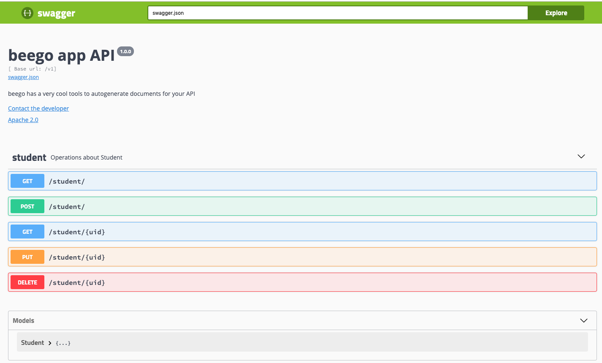

# beego-app
Based on the [Beego](https://github.com/astaxie/beego/) api.

## Quick Start

#### Download and install
`$ go get github.com/tianhanfangyan/beego-app`

#### build
`$ go build --mod=vendor -ldflags "-s -w" -o ./beego-app`

#### run
`$ ./beego-app`

## swagger

## License
* [Apache](LICENSE)